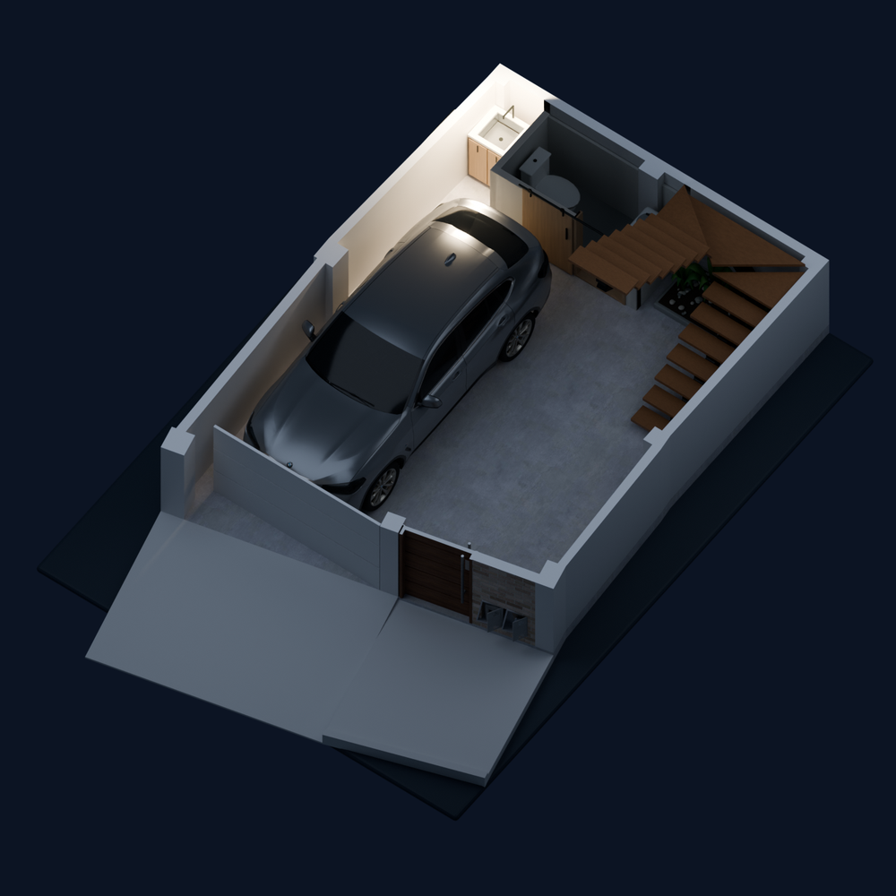
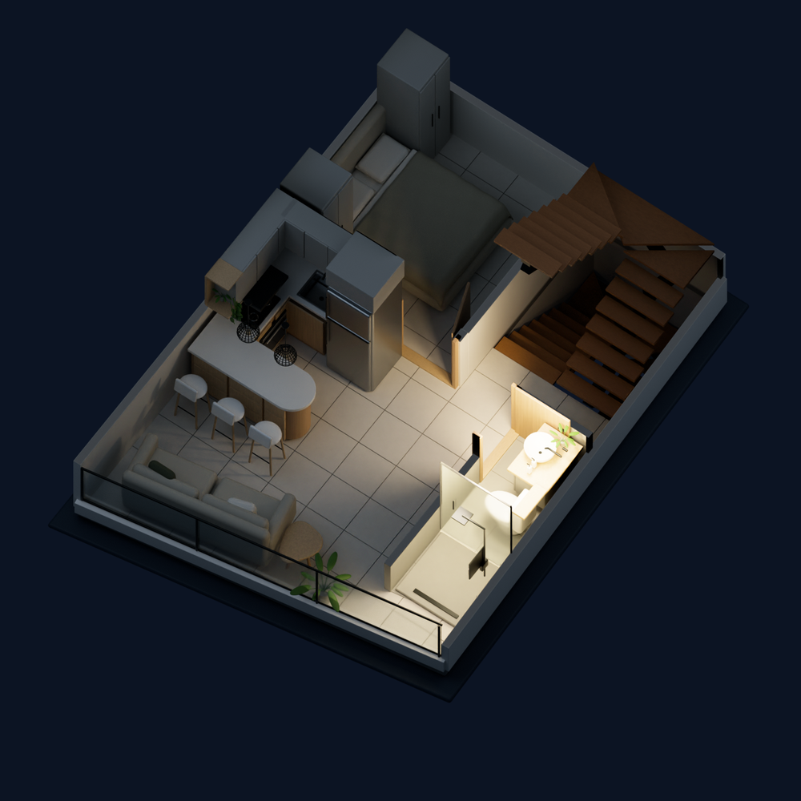
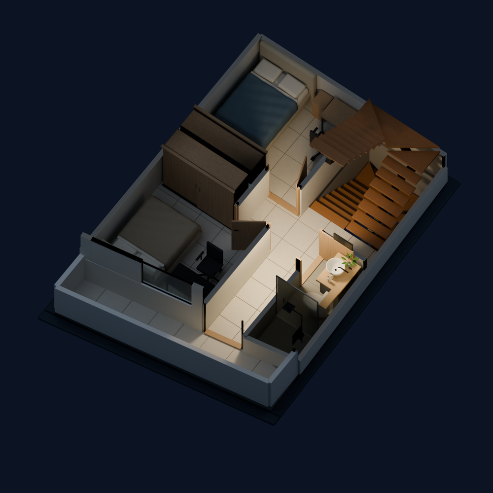

# House · 3D

A four-floor home represented in Blender and Home Assistant: independent lighting layers, read-only door status, and a device-free rooftop view. Includes **[`hm`](hm)**, a terminal launcher for managing Home Assistant with Pi + MCP.

## A look inside

**Simulated lighting—not live device states.** Only the named area is on; all other circuits are off. Click an image for detail.

| First floor · mini kitchen only | Second floor · bathroom only | Third floor · corridor only |
|:---:|:---:|:---:|
| [](docs/images/first-floor-mini-kitchen.png) | [](docs/images/second-floor-bathroom.png) | [](docs/images/third-floor-corridor.png) |

## The house

| Floor | Layout | Lighting |
|---|---|---|
| **1** | Garage, open mini kitchen, sliding-door bathroom, timber/steel stairs and a horizontal garden against the rear wall beneath them | Shared car/entrance light + mini kitchen |
| **2** | Living area, kitchen/bar, bedroom with kitchen-grey wardrobes, bathroom and stairwell | Kitchen, bar, bedroom + three bathroom circuits |
| **3** | Two bedrooms with oak wardrobes, bathroom, corridor and balcony | Bedroom light, separate neutral/warm bedroom lights, balcony and corridor |
| **4** | Laundry sink top-left, washer directly below, descending stairs top-right and a tiled roof at the front | Model only—no connected devices |

**13 independent on/off lights · 2 read-only contacts · 4 editable local models.** Contacts show Open, Closed or Unavailable; they never operate doors. All off is floor-scoped. The layout and finishes are illustrative, not construction plans.

## How it works

```text
Blender → background + light-layer PNGs → Home Assistant card
                                           ↑
                                      entity states

hm → Pi → Home Assistant MCP
```

The [custom card](dashboard/house-floorplan-card.js) combines pre-rendered images; Blender does not run inside Home Assistant. Unknown/disconnected devices are not shown as known off or closed. The fourth-floor view has no device controls. Desktop, tablet and phones down to 320 px are supported.

## Use `hm`

Requires **Bash, [Pi](https://pi.dev), [uv/uvx](https://docs.astral.sh/uv/) and `pgrep`**, plus Pi provider authentication.

```bash
export HOMEASSISTANT_URL="http://homeassistant.local:8123" # your instance
read -rsp 'Home Assistant token: ' HOMEASSISTANT_TOKEN; echo
export HOMEASSISTANT_TOKEN
./hm "Review my Home Assistant setup without making changes."
```

`hm` starts or reuses `ha-mcp-web`, loads the project-local MCP adapter, and stops only a server it started. An existing server retains its original connection settings. Credentials come from the environment, not committed files.
